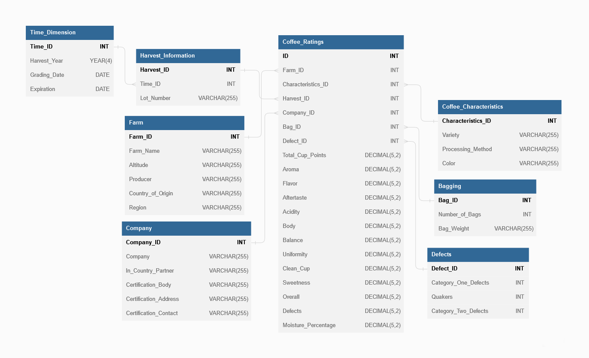

OLAP Metabase <!-- omit in toc -->
===============
*Tomáš Přibil*
---------------
*Univerzita Jana Evangelisty Purkyně*
---------------
*Katedra Informatiky*
---------------
*2022/2023*
---------------

# Obsah

- [Obsah](#obsah)
  - [1. Databázový server](#1-databázový-server)
  - [2. Výběr datové sady](#2-výběr-datové-sady)
  - [3. Vytvoření multidimenzionální datové kostky](#3-vytvoření-multidimenzionální-datové-kostky)
    - [3.1.Tabulky dimenzí](#31tabulky-dimenzí)
    - [3.2. Tabulka faktů](#32-tabulka-faktů)
  - [4. Naplnění databáze daty](#4-naplnění-databáze-daty)
  - [5. Vizualizace v Metabase](#5-vizualizace-v-metabase)
    - [5.1. Rozdělení káv podle země původu ](#51-rozdělení-káv-podle-země-původu)
    - [5.2. Průměrné hodnocení káv podle země původu ](#52-průměrné-hodnocení-káv-podle-země-původu)
    - [5.3. Průměrné hodnocení káv dle odrůdy ](#53-průměrné-hodnocení-káv-dle-odrůdy)
    - [5.4.Průměrné hodnocení káv dle nadmořské výšky ](#54průměrné-hodnocení-káv-dle-nadmořské-výšky)
    - [5.5. Průměrné hodnocení dle roku sklizně ](#55-průměrné-hodnocení-dle-roku-sklizně)
    - [5.6. Průměrné hodnocení káv dle počtu quakerů (poškozená zrna) ](#56-průměrné-hodnocení-káv-dle-počtu-quakerů-poškozená-zrna)

## 1. Databázový server
- Pro zpracování a maniplaci s daty byla použita databáze MySQL a pro správu byl použit nástroj phpMyAdmin.
- Celá tato infrastruktura - MySQL databáze a phpMyAdmin - byla nastavena v Dockeru, který umožňuje vytvořit izolované prostředí (kontejner), což usnadňuje nastavení a přenositelnost projektu.
- K vizualizaci a analýze dat byl použit Metabase, což je nástroj, který umožňuje snadno vytvářet grafy a dashboardy bez nutnosti psaní SQL dotazů.

## 2. Výběr datové sady
- V rámci tohoto projektu jsem se rozhodl využít dat z databáze Coffee Quality Institute (CQI). CQI je nezisková organizace se sídlem v Kalifornii, USA, která provádí širokou škálu aktivit v oblasti výzkumu, školení a certifikace s cílem zlepšit standardy kvality kávy, podporovat udržitelnost a podporovat rozvoj průmyslu se specializovanou kávou.
- Tato datová sada byla vybrána pro její rozsáhlé informace o kvalitě kávy, které pokrývají mnoho aspektů, včetně senzorických hodnocení, jako jsou aroma, chuť, dochuť, kyselost, vyváženost, čistý šálek a sladkost. Navíc sada obsahuje také data o defektech v kávových zrnech, které mohou ovlivnit její celkovou kvalitu.
- CQI spravuje databázi na svých webových [stránkách](https://database.coffeeinstitute.org/coffees/arabica).
- Data v csv formátu jsou dostupná na serveru Kaggle na následujícím [odkazu](https://www.kaggle.com/datasets/fatihb/coffee-quality-data-cqi?resource=download).

## 3. Vytvoření multidimenzionální datové kostky

- CSV soubor obsahoval různé druhy informací týkající se kávových hodnocení. Cílem bylo tyto informace přerozdělit do tabulek dimenzí a tabulky faktů. Struktura databáze byla vytvořena dle struktury hvězdy.
- Výsledná databáze obsahuje 7 tabulek dimenzí.
### 3.1.Tabulky dimenzí
- Time_Dimension - Tato tabulka obsahuje časovou dimenzi a je tvořena sloupci: Harvest_Year (Rok sklizně), Grading_Date (Datum hodnocení) a Expiration (Datum expirace).
- Harvest_Information - Tato tabulka obsahuje informace o sklizni a je propojena s časovou dimenzí. Sloupce jsou: Time_ID (ID časové dimenze) a Lot_Number (Číslo šarže).
- Farm - Tato tabulka obsahuje informace o farmách, na kterých byla káva pěstována. Sloupce jsou: Farm_Name (Název farmy), Altitude (Nadmořská výška), Producer (Producent), Country_of_Origin (Země původu) a Region.
- Coffee_Characteristics - Tato tabulka obsahuje charakteristiky kávy. Sloupce jsou: Variety (Odrůda), Processing_Method (Způsob zpracování), Color (Barva).
- Company - Tato tabulka obsahuje informace o firmě, která kávu zpracovává a distribuuje. Sloupce jsou: Company (Název společnosti), In_Country_Partner, Certification_Body, Certification_Address a Certification_Contact.
- Bagging - Tato tabulka obsahuje informace o balení kávy. Sloupce jsou: Number_of_Bags (Počet sáčků) a Bag_Weight (Hmotnost sáčku).
- Defects - Tato tabulka obsahuje informace o defektech v kávových zrnech. Sloupce jsou: Category_One_Defects (Defekty první kategorie), Quakers a Category_Two_Defects (Defekty druhé kategorie).
### 3.2. Tabulka faktů
- Coffee_Ratings - Tato tabulka je středem naší datové kostky. Obsahuje měřitelné hodnoty, které jsou výsledkem různých kombinací dimenzí. Sloupce jsou:
  -  cizí klíče
     -  ID, Farm_ID, Characteristics_ID, Harvest_ID, Company_ID, Bag_ID, Defect_ID
    -  hodnoty hodnocení kávy
       -  Total_Cup_Points (Celkový počet získaných bodů), Aroma (Aroma), Flavor (Chuť), Aftertaste, Acidity (Kyselost), Body, Balance, Uniformity, Clean_Cup, Sweetness, Overall, Defects a Moisture_Percentage.
## 4. Naplnění databáze daty
- Pro naplnění databáze byl použit skript napsaný v jazyce Python.
- použité knihovny:
  - csv - Knihovna určená pro práci s csv soubory.
  - pymysql - Rozhraní pro připojení k MySQL databázi z Pythonu. V tomto skriptu byla použita pro vytvoření spojení s databází a pro odeslání SQL příkazů pro vložení dat.
  - datetime - Knihovna, která poskytuje třídy pro manipulaci s daty a časy. Byla použita pro konverzi textových řetězců na datum
  - re - Modul regulárních výrazů v Pythonu, který je součástí standardní knihovny, byl použit k odstranění určitých znaků z datového řetězce, než byl převeden na datum.

## 5. Vizualizace v Metabase
- Pro vizualizaci zpracovaných dat byl použit nástroj Metabase.
### 5.1. Rozdělení káv podle země původu&nbsp;

### 5.2. Průměrné hodnocení káv podle země původu&nbsp;

### 5.3. Průměrné hodnocení káv dle odrůdy&nbsp;

### 5.4.Průměrné hodnocení káv dle nadmořské výšky&nbsp;

### 5.5. Průměrné hodnocení dle roku sklizně&nbsp;

### 5.6. Průměrné hodnocení káv dle počtu quakerů (poškozená zrna)&nbsp;