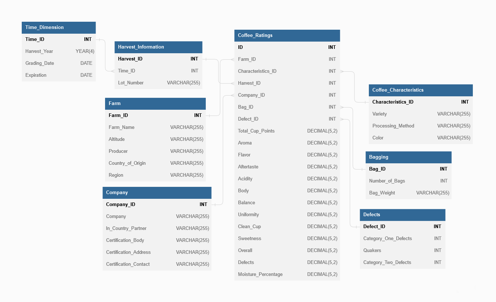

# Obsah

- [Obsah](#obsah)
  - [1. Databázový server](#1-databázový-server)
  - [2. Výběr datové sady](#2-výběr-datové-sady)
  - [3. Vytvoření multidimenzionální datové kostky](#3-vytvoření-multidimenzionální-datové-kostky)
    - [Tabulky dimenzí](#tabulky-dimenzí)
    - [Tabulka faktů](#tabulka-faktů)

## 1. Databázový server
- Pro zpracování a maniplaci s daty byla použita databáze MySQL a pro správu byl použit nástroj phpMyAdmin.
- Celá tato infrastruktura - MySQL databáze a phpMyAdmin - byla nastavena v Dockeru, který umožňuje vytvořit izolované prostředí (kontejner), což usnadňuje nastavení a přenositelnost projektu.
- K vizualizaci a analýze dat byl použit Metabase, což je nástroj, který umožňuje snadno vytvářet grafy a dashboardy bez nutnosti psaní SQL dotazů.

## 2. Výběr datové sady
- V rámci tohoto projektu jsem se rozhodl využít dat z databáze Coffee Quality Institute (CQI). CQI je nezisková organizace se sídlem v Kalifornii, USA, která provádí širokou škálu aktivit v oblasti výzkumu, školení a certifikace s cílem zlepšit standardy kvality kávy, podporovat udržitelnost a podporovat rozvoj průmyslu se specializovanou kávou.
- Tato datová sada byla vybrána pro její rozsáhlé informace o kvalitě kávy, které pokrývají mnoho aspektů, včetně senzorických hodnocení, jako jsou aroma, chuť, dochuť, kyselost, vyváženost, čistý šálek a sladkost. Navíc sada obsahuje také data o defektech v kávových zrnech, které mohou ovlivnit její celkovou kvalitu.
- CQI spravuje databázi na svých webových [stránkách](https://database.coffeeinstitute.org/coffees/arabica).
- Data v csv formátu jsou dostupná na serveru Kaggle na následujícím [odkazu](https://www.kaggle.com/datasets/fatihb/coffee-quality-data-cqi?resource=download).

## 3. Vytvoření multidimenzionální datové kostky

- CSV soubor obsahoval různé druhy informací týkající se kávových hodnocení. Cílem bylo tyto informace přerozdělit do tabulek dimenzí a tabulky faktů. Struktura databáze byla vytvořena dle struktury hvězdy.
- Výsledná databáze obsahuje 7 tabulek dimenzí.
### Tabulky dimenzí
- Time_Dimension - Tato tabulka obsahuje časovou dimenzi a je tvořena sloupci: Harvest_Year (Rok sklizně), Grading_Date (Datum hodnocení) a Expiration (Datum expirace).
- Harvest_Information - Tato tabulka obsahuje informace o sklizni a je propojena s časovou dimenzí. Sloupce jsou: Time_ID (ID časové dimenze) a Lot_Number (Číslo šarže).
- Farm - Tato tabulka obsahuje informace o farmách, na kterých byla káva pěstována. Sloupce jsou: Farm_Name (Název farmy), Altitude (Nadmořská výška), Producer (Producent), Country_of_Origin (Země původu) a Region.
- Coffee_Characteristics - Tato tabulka obsahuje charakteristiky kávy. Sloupce jsou: Variety (Odrůda), Processing_Method (Způsob zpracování), Color (Barva).
- Company - Tato tabulka obsahuje informace o firmě, která kávu zpracovává a distribuuje. Sloupce jsou: Company, In_Country_Partner, Certification_Body, Certification_Address a Certification_Contact.
- Bagging - Tato tabulka obsahuje informace o balení kávy. Sloupce jsou: Number_of_Bags (Počet sáčků) a Bag_Weight (Hmotnost sáčku).
- Defects - Tato tabulka obsahuje informace o defektech v kávových zrnech. Sloupce jsou: Category_One_Defects (Defekty první kategorie), Quakers a Category_Two_Defects (Defekty druhé kategorie).
### Tabulka faktů
- Coffee_Ratings - Tato tabulka je středem naší datové kostky. Obsahuje měřitelné hodnoty, které jsou výsledkem různých kombinací dimenzí. Sloupce jsou:
  -  cizí klíče
     -  ID, Farm_ID, Characteristics_ID, Harvest_ID, Company_ID, Bag_ID, Defect_ID
    -  hodnoty hodnocení kávy
       -  Total_Cup_Points, Aroma, Flavor, Aftertaste, Acidity, Body, Balance, Uniformity, Clean_Cup, Sweetness, Overall, Defects a Moisture_Percentage.
